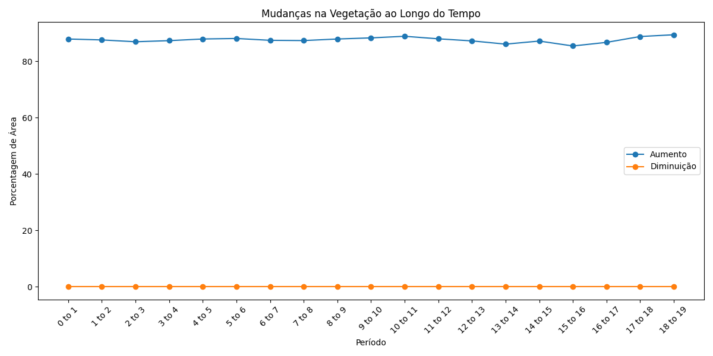
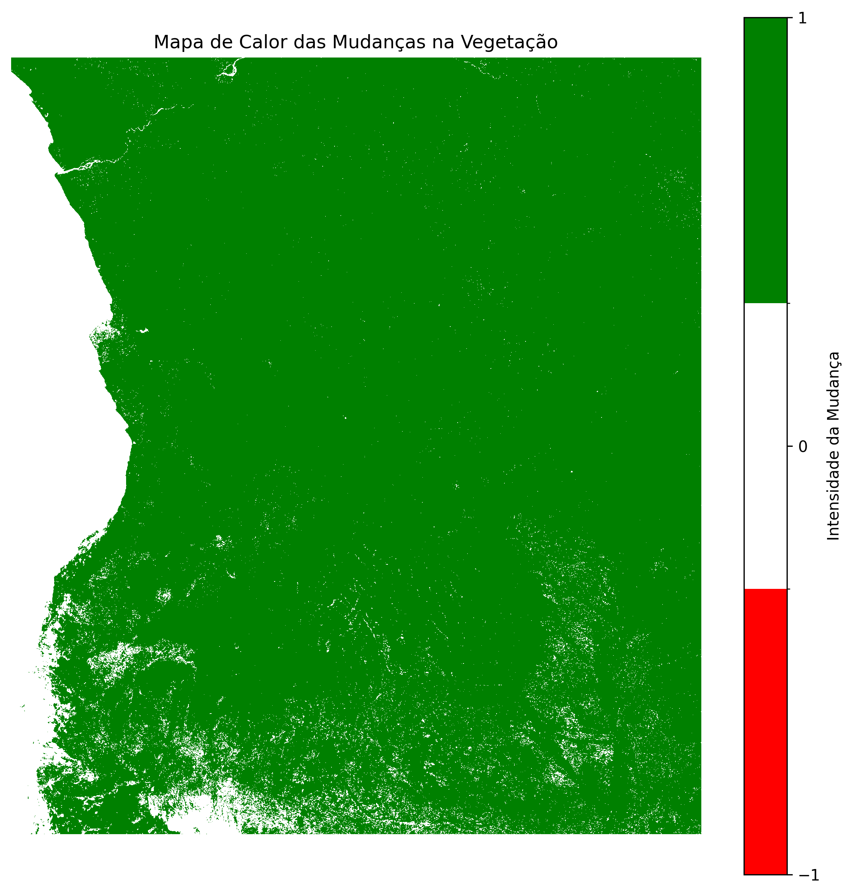

# Equipa Algorithimia_IA

## Tema: Mapeamento e Previsão da Cobertura Vegetal

### Projecto de Avaliação e Previsão de NDVI (Índice de Vegetação por Diferença Normalizada)

---

### Introdução ao Problema

A cobertura vegetal desempenha um papel fundamental no equilíbrio ambiental e no desenvolvimento sustentável. As alterações na vegetação, como o desmatamento e a degradação do solo, têm impacto directo em sectores essenciais como a agricultura, a biodiversidade e o planeamento urbano. Em Angola, avaliar a cobertura vegetal ao longo do tempo é essencial para a criação de políticas ambientais e para combater a degradação do solo. O Índice de Vegetação por Diferença Normalizada (NDVI) é uma métrica eficaz para monitorar a saúde da vegetação.

O **NDVI** permite-nos medir e monitorar as mudanças na vegetação através de imagens de satélite. Ao analisarmos os dados de NDVI de **2000 a 2022**, podemos prever mudanças futuras, identificar áreas vulneráveis ao desmatamento e guiar um uso mais sustentável da terra.

### Objectivos do Projecto

O projecto tem como objectivo:

- Calcular a média anual do NDVI para Angola de **2000 a 2022**.
- Aplicar o modelo **ARIMA** para prever a cobertura vegetal entre **2023 e 2027**.
- Visualizar as mudanças no NDVI em mapas interactivos.
- Classificar a variação do NDVI em diferentes faixas de cobertura vegetal.
- Comparar as mudanças na cobertura vegetal entre os anos utilizando mapas interactivos.
- Identificar áreas com as maiores mudanças de cobertura através de mapas de calor.
- Fornecer uma base sólida para políticas de conservação e para o planeamento agrícola e ambiental.

---

### Metodologia Técnica

#### Modelos Utilizados

1. **ARIMA** (AutoRegressive Integrated Moving Average)

   - Escolhido pela sua capacidade de modelar séries temporais e prever mudanças na vegetação com base em dados históricos.
   - Bom para capturar padrões de crescimento ou declínio vegetativo em dados de longo prazo.

2. **Prophet**
   - Usado pela sua capacidade de lidar com sazonalidade e eventos externos que possam influenciar a variação do NDVI.
   - Oferece previsões mais precisas ao lidar com as flutuações sazonais típicas da vegetação.

#### Processamento de Dados

Os dados de NDVI foram recolhidos da plataforma **MODIS/006/MOD44B** do Google Earth Engine. Para garantir a integridade dos dados, realizámos a normalização e agregação por ano, criando uma série temporal que cobre as principais regiões de Angola. As bibliotecas **Pandas**, **NumPy** e **Folium** foram usadas para manipulação, análise e visualização dos dados.

---

### Resultados e Visualizações

#### Análise das Séries Temporais

Com base nos dados históricos de NDVI, identificámos tendências significativas de degradação e recuperação em algumas regiões. As previsões para os próximos cinco anos (2023-2027) sugerem um declínio moderado em áreas vulneráveis, principalmente nas regiões críticas de desmatamento.

#### Mapas Interactivos

A visualização das mudanças de NDVI ao longo dos anos é apresentada através de **mapas interactivos** com a biblioteca **Folium**, permitindo ao utilizador explorar dados temporais e comparar previsões com dados históricos.

- **Comparação entre Anos**: Alternância de camadas para comparar a cobertura vegetal de diferentes anos.
- **Mapa de Calor**: Identifica as áreas com as maiores mudanças previstas na cobertura vegetal, facilitando a identificação de regiões prioritárias para intervenção.

---

### Aplicações Práticas

- **Governos e Políticas Públicas**: As previsões de NDVI podem auxiliar na formulação de políticas de preservação, combate ao desmatamento, e no planeamento de áreas agrícolas.
- **Agronegócio**: O projecto pode apoiar os agricultores a optimizar o uso da terra e mitigar os efeitos das mudanças climáticas sobre as culturas.
- **Organizações Ambientais**: As visualizações de mudanças de cobertura vegetal podem ser usadas para identificar áreas críticas para reflorestamento e conservação.

---

### Desafios e Limitações

- **Desafios de Modelagem**: O modelo ARIMA tem limitações em captar mudanças abruptas ou eventos climáticos extremos que possam ocorrer.
- **Precisão das Previsões**: A precisão depende da qualidade dos dados de NDVI. Actualizações regulares são necessárias para melhorar as previsões.
- **Integração de Dados Climáticos**: O uso de variáveis como precipitação e temperatura pode melhorar a precisão das previsões.

---

### Validação dos Modelos

A eficácia dos modelos foi avaliada com métricas como **MSE** (Mean Squared Error) e **MAE** (Mean Absolute Error). Comparações com outros modelos confirmaram que ARIMA e Prophet oferecem um equilíbrio entre simplicidade e precisão.

---

### Inovações e Diferenciais

- **Mapas Interactivos Dinâmicos**: A visualização interactiva permite que diferentes intervenientes analisem e tomem decisões informadas sobre mudanças na cobertura vegetal.
- **Automatização e Escalabilidade**: O projecto pode ser adaptado para outras regiões, permitindo uma monitorização global da cobertura vegetal.

---

### Plano Futuro

- **Integração de Dados Climáticos**: Pretendemos adicionar dados climáticos para melhorar a precisão das previsões.
- **Expansão para Outras Regiões**: Expandir o projecto para outras áreas críticas fora de Angola, utilizando a mesma abordagem de análise de dados.
- **Sistema de Alerta**: Desenvolver um sistema de alerta para detectar mudanças críticas na cobertura vegetal em tempo real.

---

### Conclusão

Este projecto oferece uma visão robusta sobre a evolução da cobertura vegetal em Angola, destacando áreas vulneráveis e prevendo mudanças futuras. A ferramenta é útil para governos, ONGs e o sector privado, facilitando um planeamento eficiente e sustentável para o uso da terra.

O nosso compromisso é com a preservação ambiental e a mitigação dos efeitos das mudanças climáticas, com uma abordagem orientada por dados. Este projecto é um passo importante nesta direcção.

---

### Agradecimento

Gostaríamos de expressar a nossa gratidão às plataformas de dados abertos e bibliotecas que tornaram este projecto possível, como **MODIS**, **Folium**, **Pandas** e **Prophet**.

## Agradecimento aos organizadores do Hackathon **Tecno Society** e ao **GGPEN** pela a oportunidade de desenvolver este projeto e apresentar a nossa contribuição ao sector espacial em Angola.

**_Edmauro Goma_** - Estudante de Ciencia da Computação & Entusiasta em pesquisa de inteligência artificial e software

---
